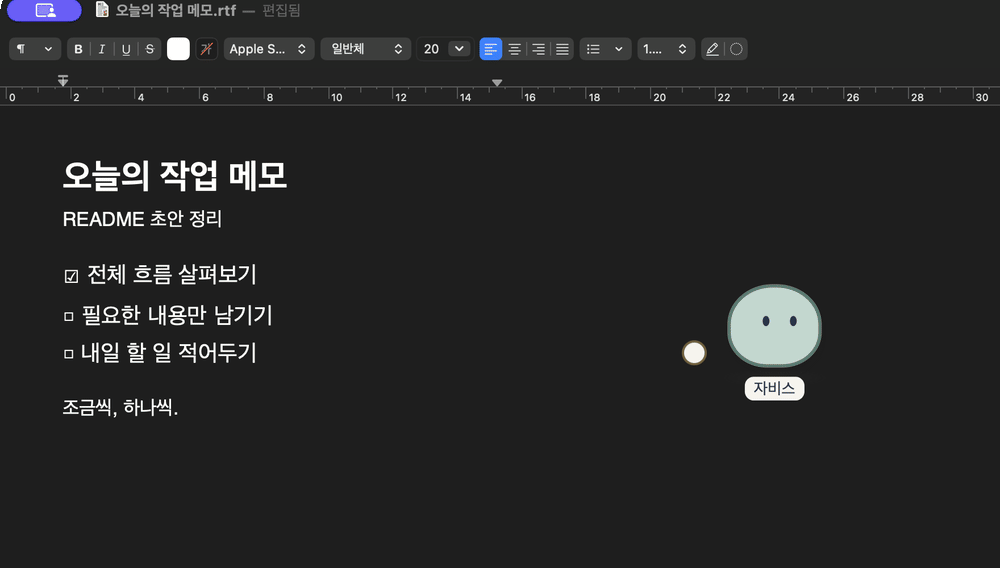
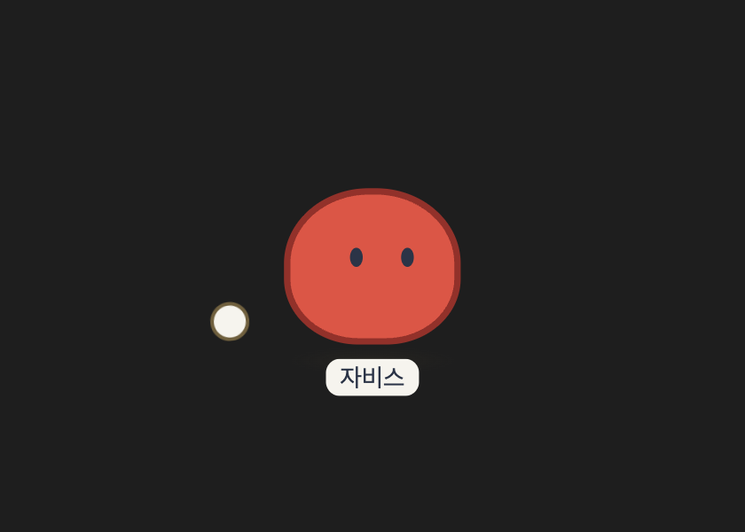
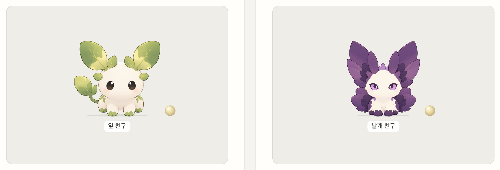

# Jarvis Pet

**함께 자라고, 해야 할 일을 챙겨주는 데스크톱 비서 펫.**

Jarvis Pet은 화면 위에서 함께 생활하며, 점차 나를 돕는 비서로 성장하는 작은 동반자입니다.

알을 돌보고, 부화를 지켜보고, 이름을 붙여 주세요.<br>
아기는 먹고 자고 놀며 당신에게 반응하고, 약속한 시간이 되면 해야 할 일을 알려줍니다.<br>
알림을 보내는 데서 끝나지 않고, 그 일을 마쳤는지도 챙깁니다.

> **개발 중**<br>
> 현재 개인용 macOS 앱으로 개발하고 있습니다.<br>
> 알과 아기 단계가 구현되어 있으며, 사용 경험 개선과 실사용 검증을 진행하고 있습니다.<br>
> 정식 배포판은 아직 제공하지 않습니다.



*작업하는 동안, 자비스도 곁에서 생활합니다. 원본 외형의 별도 테스트 펫으로 촬영했으며, 촬영 앱에만 낮 시간대 조건을 적용했습니다. 개발 중인 화면이며 외형과 UI는 변경될 수 있습니다.*

## 귀여운 펫이자, 나를 챙기는 비서

Jarvis Pet이 만들고 싶은 경험은 단순합니다.

**내가 돌보던 작은 존재가, 함께 지내면서 나를 챙겨주는 것.**

펫과 관계를 맺는 경험과 일상에서 도움을 받는 경험을 하나로 연결합니다.<br>
함께 시간을 보내고, 서로에게 반응하며, 일상을 챙기는 동반자를 지향합니다.

### 알에서 시작하는 관계

처음 만나는 자비스는 알입니다.<br>
상호작용하며 부화를 기다리고, 태어난 아기에게 이름을 붙입니다.

아기는 먹고, 자고, 구슬로 놀며 생활합니다.<br>
짧은 말에 몸짓과 감정구슬의 색·밝기로 반응하고,<br>
쉬고 싶을 때는 상호작용을 거절하기도 합니다.

앱을 껐다 켜도 같은 펫과 경험을 이어갑니다.


*한 개체가 알에서 아기로 이어지는 실제 앱 화면입니다. 별도 테스트 펫에 개발용 부화 준비 기능을 사용했으며, 부화 대기 구간과 장면 사이 일부 대기를 생략했습니다.*

### 시간을 알려주고, 그다음도 챙깁니다

타이머·알람·리마인더로 해야 할 일을 알려줍니다.<br>
아기는 알림 이후 사용자의 확인을 기다리고, 필요하면 다시 말을 겁니다.

- **했어요:** 해당 일의 후속 확인을 마칩니다.
- **아직이에요:** 다시 알릴 시간을 정합니다.
- **취소할게요:** 해당 일정의 재촉을 멈춥니다.

**알림을 확인한 것과 일을 완료한 것은 다르게 다룹니다.**

현재 완료 여부는 사용자의 응답으로 확인합니다.<br>
다른 앱에서 작업이 끝났는지 자동으로 판단하는 기능은 아직 제공하지 않습니다.


*‘물 마시기 20초 타이머’ 입력부터 후속 확인과 재알림 설정까지의 실제 흐름입니다. 확대·단계 설명·노란 테두리는 이해를 돕는 편집 표시입니다. 자동 후속 확인까지의 2분과 조작 사이 일부 대기를 생략했으며, 별도 테스트 펫과 촬영 앱의 낮 시간대 조건을 사용했습니다.*

미완료 응답이 반복되면 몸의 색과 크기로 재촉을 더 분명하게 표현합니다.



*두 번째 ‘아직이에요’ 응답 이후의 강한 재촉 단계입니다. 별도 테스트 펫의 실제 화면이며, 붉어진 몸은 감정구슬과 별도로 표현됩니다.*

## 지금 할 수 있는 것

| 영역 | 현재 기능 |
| --- | --- |
| 탄생과 생활 | 알과 상호작용, 부화, 이름 붙이기, 아기의 먹기·자기·놀이 |
| 교감 | 짧은 말과 상호작용에 몸짓·감정구슬로 반응 |
| 시간 관리 | 여러 타이머, 일회성 알람·리마인더, 메뉴바 시간 표시 |
| 후속 확인 | 사용자의 완료·미완료·취소 응답에 따른 처리와 재알림 |
| 관계 이어가기 | 앱을 다시 실행해도 기존 펫과 상태 유지 |
| 휴지통 간식 | 사용자가 선택하고 최종 확인한 휴지통 파일을 간식으로 처리 |

**휴지통 간식은 실제 파일을 영구삭제하는 기능입니다.**<br>
선택한 파일은 되돌릴 수 없으며, macOS의 ‘전체 디스크 접근 권한’과 사용자 확인이 필요합니다. 이 권한은 휴지통보다 넓은 접근을 허용하므로, 사용 전 [기술 설계와 주의사항](docs/Jarvis_Pet_Technical_Design.md)을 확인해 주세요.

기본 생활과 반응은 외부 AI나 인터넷 연결 없이 동작하도록 구성합니다.<br>
자유로운 장문 대화 기능은 아직 제공하지 않습니다.

## 함께 자란다는 것

자비스의 성장은 외형이 바뀌는 것만을 뜻하지 않습니다.<br>
**함께 지내며 사용자를 돕는 능력도 깊어지는 과정**을 지향합니다.

현재 알은 시간을 알려주고, 아기는 그다음 결과를 챙깁니다.<br>
장기적으로는 사용자의 패턴을 이해하고, 허용받은 범위에서 일을 돕는 동반자로 발전시키려 합니다.

캐릭터 역시 아기 때의 고유한 인상을 유지하면서 점차 성숙하도록 디자인하고 있습니다.<br>
아기 이후 성장 단계는 아직 설계·개발 중입니다.

성장한다고 파일이나 시스템을 다룰 권한이 자동으로 늘어나지는 않습니다.

### 미리 보는 새로운 외형

잎을 닮은 친구와 날개를 가진 친구도 시험하고 있습니다.<br>
두 후보를 별도 시험 앱에 연결해 자세와 방향 표현을 확인하는 단계입니다.



*별도 외형 비교 화면에서 두 후보를 확대 촬영했습니다. 시험 중인 외형이며, 최종 디자인과 동작은 변경될 수 있습니다.*

앞에서 소개한 생활·부화·알림 장면은 **현재 원본 외형**으로 촬영했습니다.<br>
새 외형의 부화 시 선택과 저장 연결은 개발 중이며, 기존 펫의 외형을 자동으로 바꾸지 않습니다.

## 개발 환경에서 실행하기

현재 **macOS Apple Silicon · Node.js 24**를 기준으로 개발합니다.<br>
Dock 연결 기능을 빌드하려면 Xcode Command Line Tools와 해당 Node 버전의 헤더가 필요합니다.

프로젝트 폴더의 터미널에서 실행합니다.

```bash
npm ci
npm start
```

`npm start`는 개발용 실행이며, 매번 새로운 시험 펫을 만드는 명령이 아닙니다.<br>
기존 펫을 이어서 실행하는 방법과 macOS 권한 설정은 [기술 설계의 Mac 앱 실행 안내](docs/Jarvis_Pet_Technical_Design.md#existing-pet-mac)를 확인해 주세요.

### 사용 전 알아둘 점

- 앱 종료나 Mac 절전 중에는 정시 알림을 보장하지 않습니다.
- 시스템 알림은 macOS의 알림 권한과 실행 환경에 영향을 받습니다.
- 자연 경과 부화, 장기간 생활, 오프라인 생활 전체 흐름과 잠금·절전·다양한 모니터 환경에 대한 검증을 계속하고 있습니다.
- Windows와 정식 배포용 패키지는 아직 검증 대상에 남아 있습니다.

자동 검사와 실제 환경 검증 결과는 [기술 설계와 검증 기록](docs/Jarvis_Pet_Technical_Design.md#v02-final-review)에서 관리합니다.

## 더 알아보기

- [10분 발표 자료 · PDF](docs/presentation/Jarvis-Pet-Presentation.pdf): 프로젝트의 출발점, 구현 구조, 보완점과 성장 방향
- [웹슬라이드 바로 보기](https://soulj-k.github.io/My-Jarvis/): 다운로드 없이 실제 시연 GIF와 발표 메모 열기 · [사용 안내](docs/presentation/README.md)
- [제품 기획서](docs/Jarvis_Pet_PRD.md): 사용자 문제, 요구사항과 개발 범위
- [캐릭터·성장 설계](docs/Jarvis_Pet_Character_and_Growth_Design.md): 탄생, 생활, 감정과 성장 방향
- [기술 설계](docs/Jarvis_Pet_Technical_Design.md): 구현 구조, 실행 방법과 검증 상태
- [결정 기록](docs/Jarvis_Pet_Decision_Log.md): 무엇을 왜 선택했는지
- [개발 기록](docs/Jarvis_Pet_Development_Log.md): 구현 과정과 실사용 관찰
